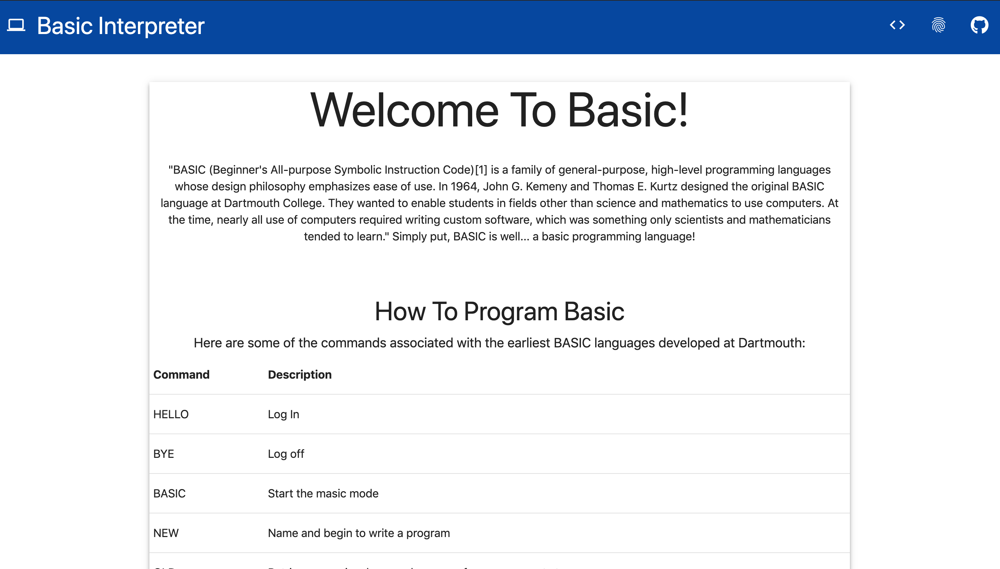
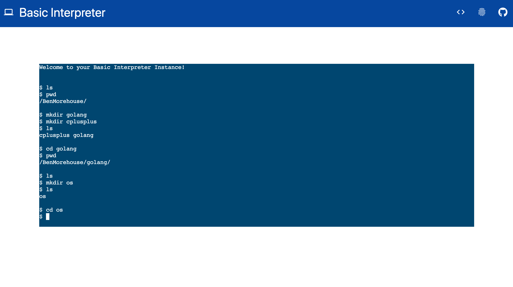
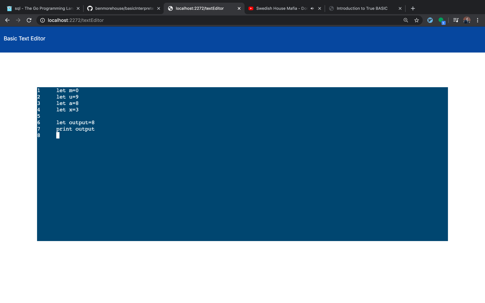
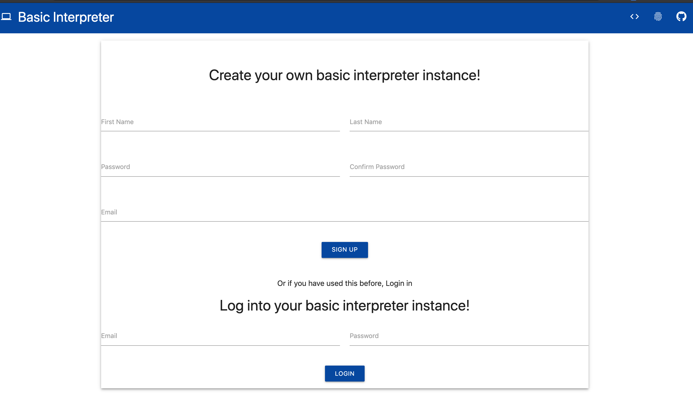

# An Interpreter for the BASIC programming language

I built an interpreter of the rustic programmaing language BASIC in c++. I then created a server
that hosts a slew of features including:

- user authentiacation
- file storage
- directory interactions and storage
- file editing
- and more!

# A quick look!

